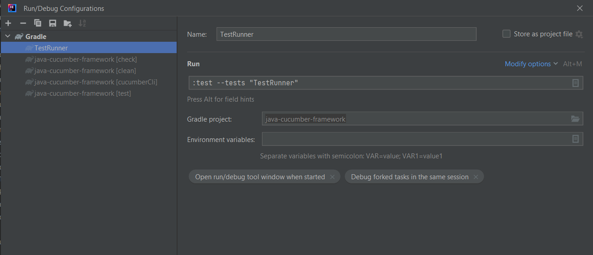
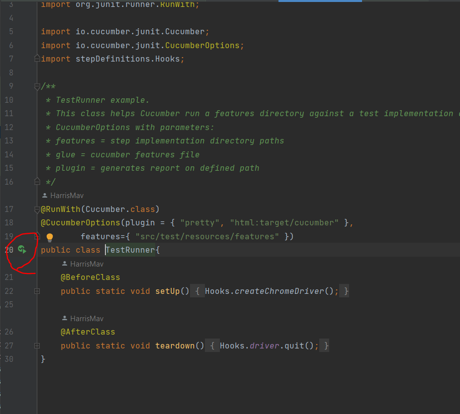

# Java Cucumber Framework

## Time spent
~6hrs

## Prerequisites
- Java 12 - though it is backwards compatible
- Most recent Gradle - strongly suggested this is ran with the projects Gradle Wrapper
- Most recent version of Chrome - if you need to check that go on triple dots on Chrome > About Chrome > version will be the first thing that appears
- IntelliJ community/edu/ultimate - if this **MUST** be ran anywhere else please use the Git Bash console (if on Windows)

## Setup

The exercise was done on a brand new Windows machine so a lot of the steps might be a bit extra for another developer, 
though this is the step-by-step walkthrough on getting this project setup from 0.
Have got the latest powershell & NET.Framework installed. Then on powershell ran the following
- `Set-ExecutionPolicy AllSigned` mandatory step on installing Chocolatey according to documentation https://docs.chocolatey.org/en-us/
- `Set-ExecutionPolicy Bypass -Scope Process -Force; [System.Net.ServicePointManager]::SecurityProtocol = [System.Net.ServicePointManager]::SecurityProtocol -bor 3072; iex ((New-Object System.Net.WebClient).DownloadString('https://community.chocolatey.org/install.ps1'))` to install Chocolatey
- `choco install git`
- `choco install intellijidea-edu`
- `choco install openjdk.portable`

Once the basic setup is done, to get started with the framework you will need to proceed with a Gradle build. An observation
while building this project was that JUnit 5+, being the most recent one, doesn't exactly play well with Cucumber at the moment,
we will need some extra vintage dependencies that are created for purposes like this. Those are added on the build file so the
only thing that needs to be done for the project to be set up is run:
- `gradle build`

**If Gradle isn't installed on your system, you can run this command & any other you'd want by checking the side panels

And then  
**

## Development Methodology : Trunk Based Development (TBD)

The best software development methodology I've worked under is hands down TBD, the aim is that the work will be done on 1
branch, the trunk, which normally when there are releases would be the Development branch, though in our case since there aren't any will just have 1 master branch
. Every commit will be pushed on our master branch, in a team setting it would have to go through review 
on a 1-2-1 call and be approved by the other person on the spot, though since there is a sole developer and reviewer on this
effort will be operating with very regular commits. Then problems can be traced back just by looking into fractions
of work and not by investing a long time reviewing what went wrong on branches that contain a lot of commits in them.

## Design choices

Generally speaking the Cucumber frameworks are made for business users to be able to write their own tests
therefore it is created with that in mind. All steps are almost like building blocks where if we were to roll out
to a project I could create a glossary of what each step does and then have the user use them. Though this as an idea can't
go wrong the website doesn't let you work in such way. Lack of ids and elements working in a non standard way for example selects
make it very hard to use tools like Selenium on so we might need to diverge in implementation for similar elements. Currently
most steps try to resolve 1-2-1 action. The exceptions are:

- Comparison: the comparison of the table pre and after filters is something I had a lot of solutions for. I do not think
I chose the best one, since for something like that I would normally use a database or I would create my internal API. 
Time constraints refrained me from doing that and have to use a static variable, where on concurrent testing execution
it might do more harm than good. 
Though it can be coded in a way that there can be a unique StepDefinitions instance for every 
Thread, making this design choice not bad if I decided to double down on it and develop a framework with something like that
in mind, obvious drawback is, how many tests are actually going to use something similar? If answer is a lot that means 
my suggested solution isn't ideal though if I created an API or Database it would be. 
- Filling a range filter: the range filter breaks my own rule of creating steps that represent building blocks, but creating
unique mini processes like filling a range between 2 values or reading a big table and remembering the values it can be justified
as long as there is good documentation behind which on a workplace setting there would be a detailed explanation of how they
work for non-technical users.
- Selenium: created the framework with Selenium it was non-ideal. Had the knowledge beforehands that it was quirky but 
choosing PlayWright was the right thing all along. Many of the walls I found with Selenium are built-in on PlayWring and 
the project would probably be 2x faster to complete. About every different step needed a special solution and way of resolving it
though managed to generalise steps as much as possible. 

## Running tests
2 main ways of doing it:

- 1 : `gradle test`
- 2 : create a run configuration like this

## Things that need to be done differently
- Thread.Sleep: the solution heavily relies on this for consistency reasons. Even though the solution works
when it comes to applying filters there are a lot of Ajax calls happening and Selenium doesn't have a good in-built way 
to wait for those. For time's sake I didn't do it but I spotted the problem and know the workaround to this. Though to do 
with Selenium requires a lot of trial and failure which couldn't invest at the moment to get this working example up. 
Though with PlayWright this issue is non-existent because the solution is in-built or it seems like it. Had a run 
with PlayWright post-exercise completion and it looked like it was the right choice all along. 
- Comparison: can be done more effectively. On a large table this can become slow. Have to write a few methods to snapshot 
the data and load them in as Strings instead of calling every TD individually. The String from the trs is more than enough for
the completion of this exercise.
- HashMaps over Arraylists: the assignment was to compare them, well I could create a key-value pair to compare them instead of
comparing everything together. Could just check if the keys of both HashMaps were the same, and should I ever wanted to parse
the rest of the columns requested I only ever had to compare the values. 