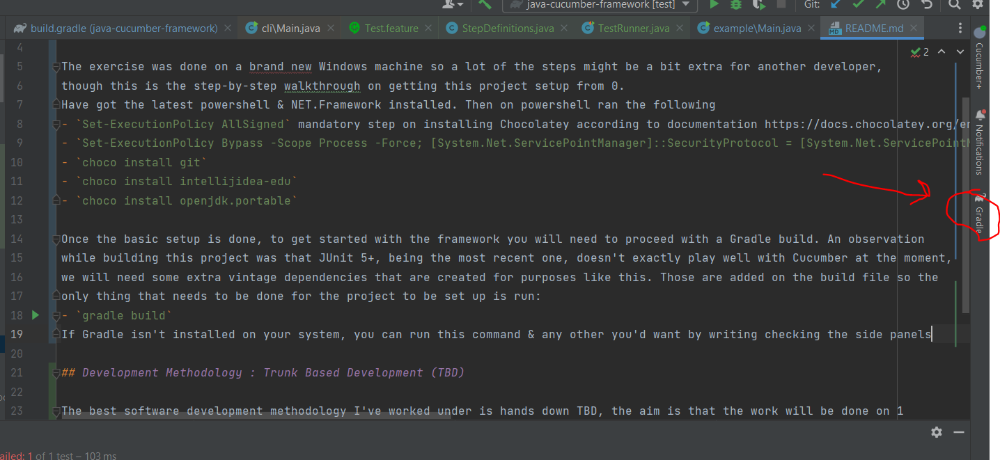
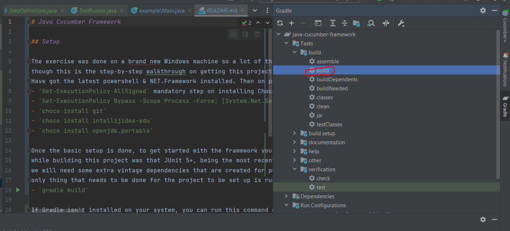

# Java Cucumber Framework

## Setup

The exercise was done on a brand new Windows machine so a lot of the steps might be a bit extra for another developer, 
though this is the step-by-step walkthrough on getting this project setup from 0.
Have got the latest powershell & NET.Framework installed. Then on powershell ran the following
- `Set-ExecutionPolicy AllSigned` mandatory step on installing Chocolatey according to documentation https://docs.chocolatey.org/en-us/
- `Set-ExecutionPolicy Bypass -Scope Process -Force; [System.Net.ServicePointManager]::SecurityProtocol = [System.Net.ServicePointManager]::SecurityProtocol -bor 3072; iex ((New-Object System.Net.WebClient).DownloadString('https://community.chocolatey.org/install.ps1'))` to install Chocolatey
- `choco install git`
- `choco install intellijidea-edu`
- `choco install openjdk.portable`

Once the basic setup is done, to get started with the framework you will need to proceed with a Gradle build. An observation
while building this project was that JUnit 5+, being the most recent one, doesn't exactly play well with Cucumber at the moment,
we will need some extra vintage dependencies that are created for purposes like this. Those are added on the build file so the
only thing that needs to be done for the project to be set up is run:
- `gradle build`

**If Gradle isn't installed on your system, you can run this command & any other you'd want by writing checking the side panels

And then  
**
## Development Methodology : Trunk Based Development (TBD)

The best software development methodology I've worked under is hands down TBD, the aim is that the work will be done on 1
branch, the trunk, which normally when there are releases would be the Development branch, though in our case since there aren't any will just have 1 master branch
. Every commit will be pushed on our master branch, in a team setting it would have to go through review 
on a 1-2-1 call and be approved by the other person on the spot, though since there is a sole developer and reviewer on this
effort will be operating with very regular commits. Then problems can be traced back just by looking into fractions
of work and not by investing a long time reviewing what went wrong on branches that contain a lot of commits in them.